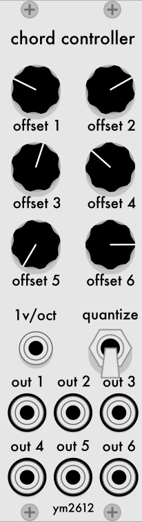

# ChordController

A plugin for VCV Rack. Generates six CV outputs based on a single 1v/o input and six offset knobs. 

When the "quantize" switch is on, each individual CV output is quantized to semitones.

[Binary download (Mac)](/wilsontr/vcv-plugins/releases/tag/v1.0.0)

